# Google API Console အသုံးပြု၍ Google Analytics နှင့် ချိတ်ဆက်ခြင်း

Google Analytics မှာ Report data တွေရလာပြီဆိုရင် အဲ့ data တွေကို ကျွန်တော်တို့ Laravel app ကနေ access လုပ်ကြပါမယ်။ <br>
အဲ့အတွက်က GA ကို တိုက်ရိုက် access မရပါဘူး။ Google API Console ကမှပဲ access ရပါမယ်။ GAC ကတော့ Google service က data တွေကို အပြင် third-party တွေကနေ လှမ်းခေါ်လို့ရအောင် လုပ်ပေးတဲ့ service ဖြစ်ပါတယ်။

## <a id="content"></a>မာတိကာ
- [Google API Console ကို စတင်အသုံးပြုခြင်း](#gac-setup)
- [Google Analytics တွင် Account ကို Permission ပေးခြင်း](#acc-permission)
- [Laravel app နှင့်ချိတ်ဆက်ခြင်း](#laravel-int)
- [Controller တွင်အသုံးပြုရန်](#using-in-controller)
- [စာကြွင်း](#disclaimer)

## <a id="gac-setup"></a>Google API Console ကို စတင်အသုံးပြုခြင်း

1. https://console.developers.google.com သို့ သွားပါ။
2. လိုအပ်တဲ့ setting များထည့်ပါ။ *(Optional)*
	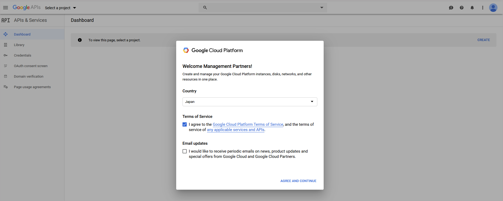
3. **Select a project** > **New Project** ကို နှိပ်ပါ။
	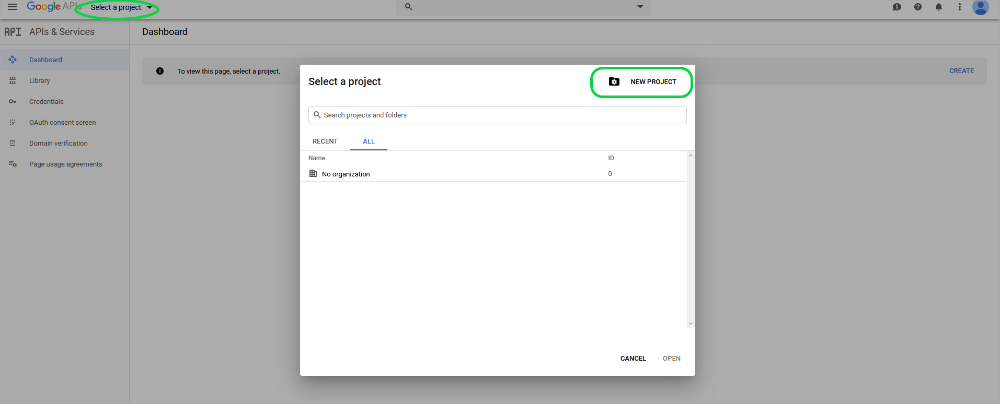
4. Project Name ကို သင့်တော်တာ တစ်ခုပေးပါ။ project အသစ်ဆောက်ပြီးသွားရင် Dashboard ကိုပြန်ရောက်သွားပါမယ်။
	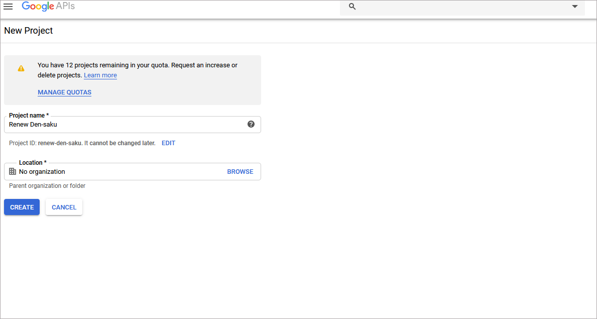
5. OAuth consent screen setting ကိုသွားပါ။ လိုအပ်တာတွေ (Application name, logo, domain, homepage link) ကို ရှိရင်ထည့်ပါ။ Save နှိပ်ပါ။
	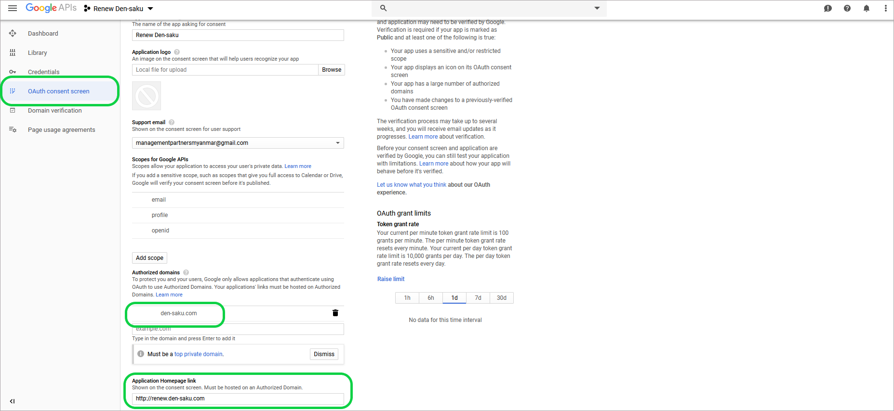
6. Credentials setting ကိုရောက်သွားပါလိမ့်မယ်။ Create credentials button ကနေ Service Account Key ကိုရွေးပါ။
	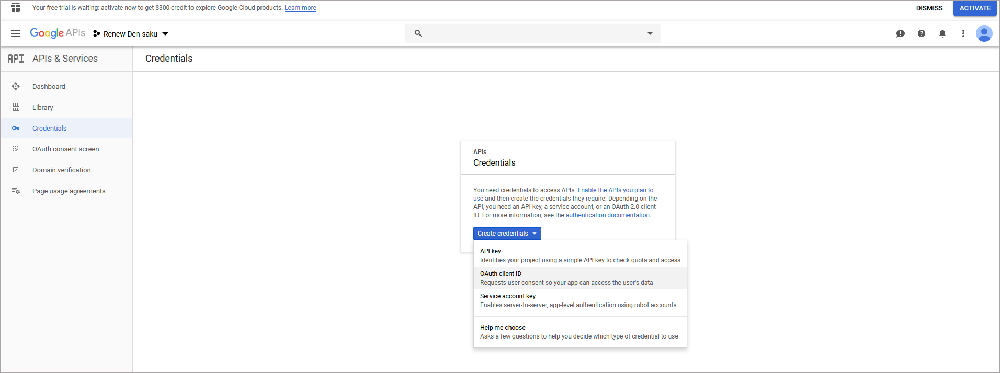
7. အောက်ပါအတိုင်း ထည့်ပါ။
	- Service account: New serivce account
	- Serivce account name: ကြိုက်တာထည့်လို့ရပါတယ်။ ဒီမှာတော့ ရှင်းရှင်းပဲ `api-user` လို့ထည့်လိုက်ပါမယ်။
	- Role: အလွတ်ပဲထားပါ။
	- Service account ID: အကောင့် name ပေးတုန်းက သူ့ဘာသူ auto ထည့်ပေးလိုက်တဲ့ value ရှိနေပါမယ်။ ပြင်စရာမလို့ပါဘူး။ သို့ပေမဲ့ Google Analytics မှာ ပြန်သုံးရမှာဖြစ်တဲ့အတွက် copy ကူးထားပါ။
	- Key type: JSON ပဲထားပါ။
	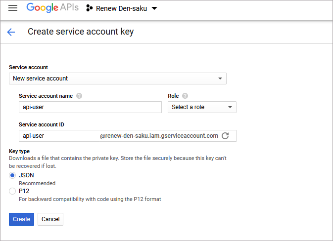
8. Create ကိုနှိပ်ပါ။ Dialog ကျလာရင် create without role ဆိုတာပဲရွေးလိုက်ပါ။
9. JSON ဖိုင်တစ်ခု auto download ကျလာပါမယ်။ Download ဆွဲထားလိုက်ပါ။ Laravel app ထဲမှာ သုံးရမှာဖြစ်ပါတယ်။
10. API Dashboard ကိုပြန်သွားပါ။ သွားနည်းကိုအောက်မှာ ပြထားပါတယ်။
	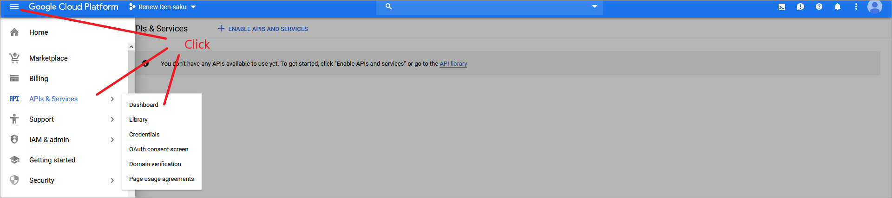
11. Enable API and Serivces ဆိုတာကို နှိပ်ပါ။
	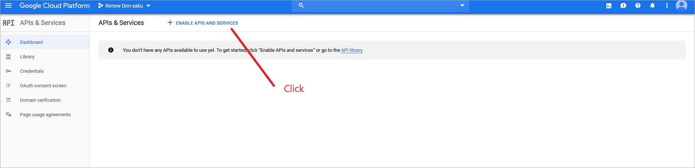
12. ကျလာတဲ့ search box မှာ google analytics ဆိုပြီးရိုက်ရှာပါ။ သတိပြုရန်: ကျလာရင် Google Analytics API ကိုရွေးပေးရပါမယ်။ Google Analytics Reporting API မဟုတ်ပါဘူး။
	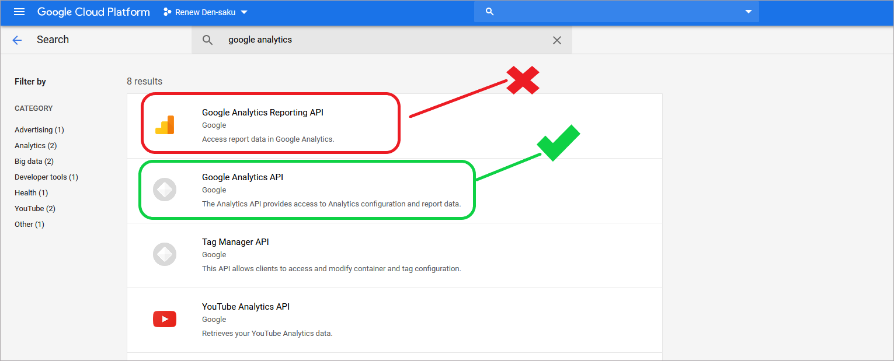
13. ရွေးပြီးရင် Enable ဆိုတာကိုနှိပ်ပါ။
	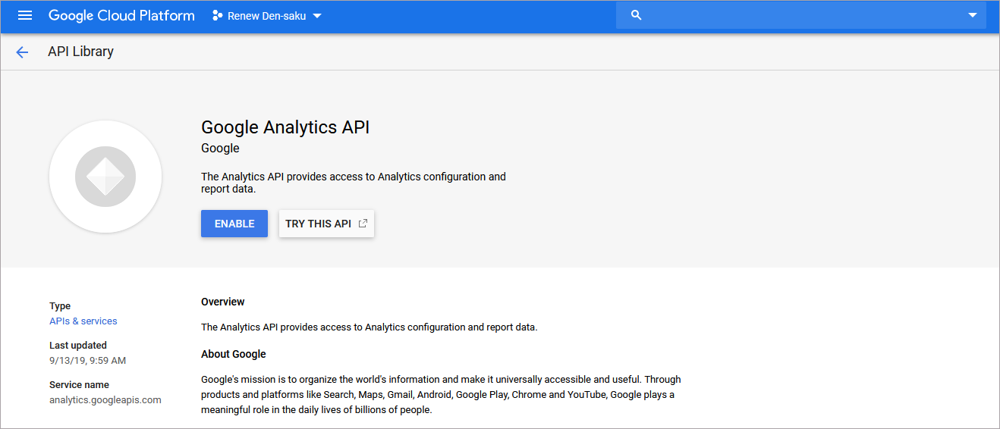

## <a id="acc-permission"></a> Google Analytics တွင် Account ကို Permission ပေးခြင်း

1. https://analytics.google.com သို့သွားပါ။
2. ဘယ်ဘက်အောက်နားမှာ Admin ဆိုတဲ့ button ကိုနှိပ်ပါ။ Account, Property မှန်မမှန်စစ်ဆေးပါ။ မှန်ပြီဆိုရင် User Management ဆိုတာကို နှိပ်ပါ။
	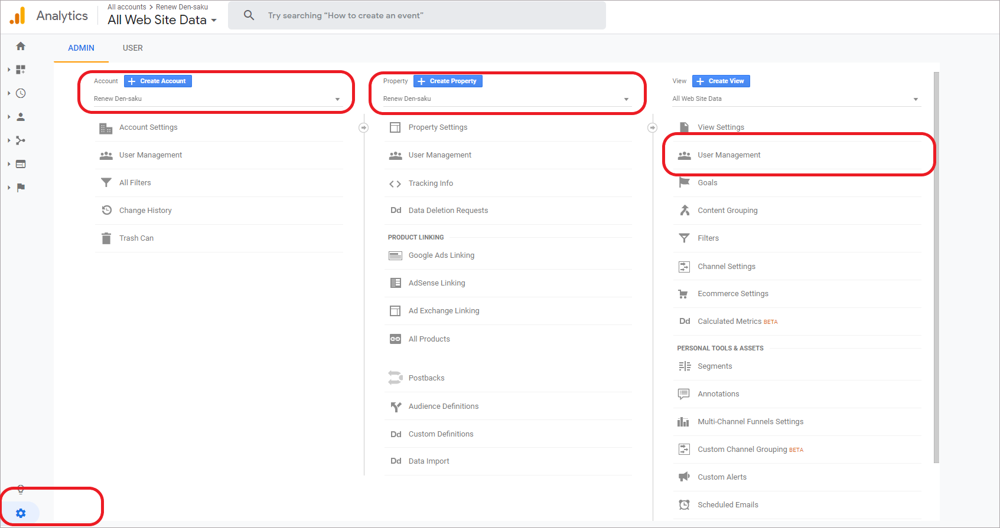
3. ညာဘက် အပေါ်မှာ `+` ဆိုတာကိုရွေးပြီးတော့ Add Users ဆိုတာကိုရွေးလိုက်ပါ။
	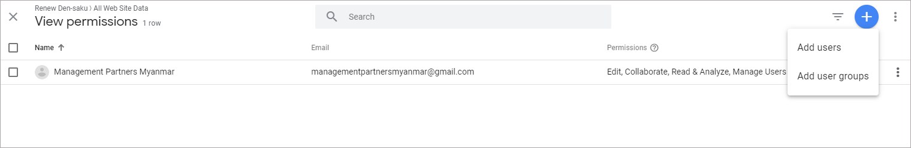
4. ဒီအဆင့်မှာ email က အဆင့် ၇ မှာထည့်ခဲ့တဲ့ email ကိုထည့်ရပါတယ်။ တစ်နည်းအားဖြင့်ဆိုရင်တော့ အထက်မှာလုပ်ခဲ့တဲ့ service account ရဲ့ mail ဖြစ်ပါတယ်။ ကျွန်တော့် Case မှာတော့ `api-user@renew-den-saku.iam.gserviceaccount.com` ဖြစ်ပါတယ်။
	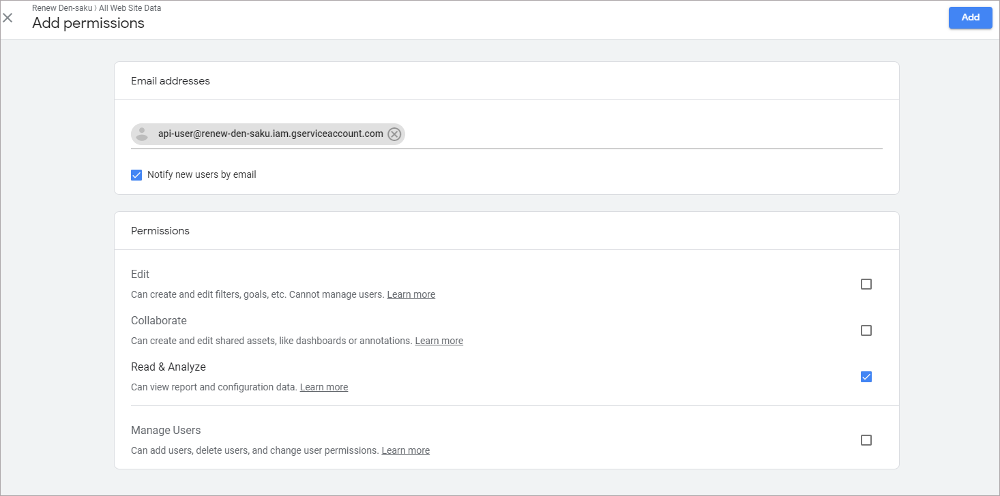
5. Permissions မှာတော့ Read & Analyze ဆိုတာရွေးပြီးထားလိုက်ပါ။ ပြီးရင် ညာဖက်ထိပ်မှာ Add ဆိုတာကို နှိပ်ပါ။
6. ပြီးသွားရင် Dialog ကိုပိတ်လိုက်ပါ။ အထက်က User Management ဆိုတဲ့ အပေါ်မှာ View Setting ဆိုတာရှိပါတယ်။ အဲ့ထဲဝင်လိုက်ပါ။
7. View ID ကို copy ကူးထားပါ။
	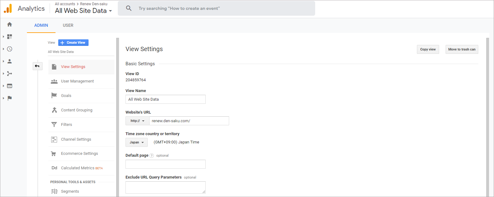

## <a id="laravel-int"></a>Laravel app နှင့်ချိတ်ဆက်ခြင်း

1. ဒီအဆင့်ရောက်ရင်တော့ အထက်ကနေလုပ်ခဲ့ကြတဲ့ JOSN ဖိုင်နဲ့ View ID က ready ဖြစ်နေရပါမယ်။ *(ပထမပိုင်း အဆင့် ၉ နှင့် ဒုတိယပိုင်း အဆင့် ၇)*
2. ကျွန်တော်တို့က https://github.com/spatie/laravel-analytics ဆိုတဲ့ package ကိုသုံးမှာဖြစ်ပါတယ်။
3. laravel app အောက်မှာ terminal (command prompt) ကိုဖွင့်ပါ။
4. `composer require spatie/laravel-analytics:3.7.0` ဆိုပြီး install လုပ်ပါ။ *(ကျွန်တော်တို့ရဲ့ laravel က version 5.8 ဖြစ်လို့ သူပြောထားတဲ့အတိုင်း 3.7.0 ကိုသုံးပါတယ်။)*
5. ပြီးသွားရင် `php artisan vendor:publish --provider="Spatie\Analytics\AnalyticsServiceProvider"` ဆိုပြီး run လိုက်ပါ။ 
6. `config/analytics.php` file ကိုဖွင့်လိုက်ပါ။
7. setting ၂ ခုပြောင်းရပါမယ်။ ပထမက view_id ဖြစ်ပါတယ်။ ဒုတိယကတော့ JSON ဖိုင် setting ပါ။
	```PHP
	return [

		/*
		* The view id of which you want to display data.
		*/
		'view_id' => env('ANALYTICS_VIEW_ID'),

		/*
		* Path to the client secret json file. Take a look at the README of this package
		* to learn how to get this file. You can also pass the credentials as an array 
		* instead of a file path.
		*/
		'service_account_credentials_json' => storage_path('app/analytics/service-account-credentials.json'),

		/*
		* The amount of minutes the Google API responses will be cached.
		* If you set this to zero, the responses won't be cached at all.
		*/
		'cache_lifetime_in_minutes' => 60 * 24,

		/*
		* Here you may configure the "store" that the underlying Google_Client will
		* use to store it's data.  You may also add extra parameters that will
		* be passed on setCacheConfig (see docs for google-api-php-client).
		*
		* Optional parameters: "lifetime", "prefix"
		*/
		'cache' => [
			'store' => 'file',
		],
	];
	```
8. `view_id` ကတော့ `.env` file ထဲမှာပဲ ထည့်ပါမယ်။ `.env` ဖိုင်ထဲမှာ `ANALYTICS_VIEW_ID=` ဆိုပြီး အထက်ကမှတ်ထားတဲ့ view ID နဲ့ ထည့်ပေးလိုက်ပါ။
9. JSON ဖိုင်အတွက်ကတော့ `{project_folder}/storage/app/analytics` ဆိုပြီး folder ဆောက်ပါ။
10. Download ဆွဲထားတဲ့ JSON ဖိုင်ကို `service-account-credentials.json` သို့ rename လုပ်ပြီး အထက်ပါ folder အောက်မှာ သွားထည့်လိုက်ပါ။
11. ဒါဆိုရင်တော့ ချိတ်ပြီးသွားပြီဖြစ်ပါတယ်။

## <a id="using-in-controller"></a>Controller တွင်အသုံးပြုရန်

`AdminStatisticsController.php` ကို Reference လုပ်ပါ။

## <a id="disclaimer"></a>စာကြွင်း

- Query parameter များကို အောက်ပါလင့်မှာ စမ်းသပ်အသုံးပြုနိုင်ပါတယ်။ <br>
	https://ga-dev-tools.appspot.com/query-explorer/


