# Densaku App တွင် Google Analytics(GA) နှင့် Google Tag Manager(GTM) ကိုအသုံးပြုခြင်း

## <a id="content"></a>မာတိကာ
- [Use Case Scenario](#use-case)
- [သီအိုရီတွေးတောခြင်း](#theorycrafting)
- [GA စတင်သုံးစွဲခြင်း](#ga-setup)
- [GTM စတင်သုံးစွဲခြင်း](#gtm-setup)
- [အသေးစိတ်စီမံခန့်ခွဲခြင်း](#detail-manage)
	- [Product List Page ကို စီမံခန့်ခွဲခြင်း](#manage-product-list)
	- [Product Detail View Count ကိုစီမံခန့်ခွဲခြင်း](#product-detail-manage)


## ကိုးကားစာများ
https://www.orbitmedia.com/blog/what-is-google-tag-manager-and-why-use-it/

## <a id="use-case">Use Case Scenario
- Top Page View Count, Product List Page View Count နှင့် Product View Count တို့ကို code အတတ်နိုင်ဆုံးနည်းအောင်ရေး၍ လုပ်ရန်

## <a id="theorycrafting"></a>သီအိုရီတွေးတောခြင်း
- Q: Google Analytics(GA) ဘာလဲ? ဘယ်လဲ? <br>
 A: GA ဆိုတာက website တွေရဲ့ အခြေအနေအမျိုးမျိုးကို လေ့လာစောင့်ကြည့်တဲ့ ဝန်ဆောင်မှုဖြစ်ပါတယ်။
- Q: Google Tag Manager(GTM) ဘာလဲ? ဘယ်လဲ? <br>
 A: GTM ဆိုတာက website တွေရဲ့ event အမျိုးမျိုး (button click, link click, page load) ကို page source code မှာ သွားရေးနေစရာမလိုဘဲ track လုပ်ပေးတဲ့ ဝန်ဆောင်မှုဖြစ်ပါတယ်။ သူက event တွေ fire ဖြစ်တိုင်း Third party service တွေကို event information data တွေပို့ပေးမဲ့ code လို့ပြောလည်းရပါတယ်။ 
- Q: Page view count ကြည့်ဖို့ဆို GA တစ်ခုတည်းနဲ့ မလုံလောက်ဘူးလား? <br>
 A: လုံလောက်ပါတယ်။ ဒါပေမဲ့ Product view count အတွက်ကြတော့ product code နဲ့ product name ပါတွဲပြချင်တဲ့အတွက် website ကနေ customized data တွေပို့နိုင်ဖို့ရာ GTM ကိုသုံးရပါတယ်။

## <a id="ga-setup">GA စတင်သုံးစွဲခြင်း
1. https://analytics.google.com သို့သွားပါ။
2. login မဝင်ရသေးရင် login ဝင်ပါ။
3. create account နှိပ်လိုက်ပါ။ ဒီအကောင့်က GA account ကိုပြောတာဖြစ်ပါတယ်။
4. account name ထည့်ပါ။ ကျန်တာဒီတိုင်းထားပြီး Next နှိပ်ပါ။<br>
	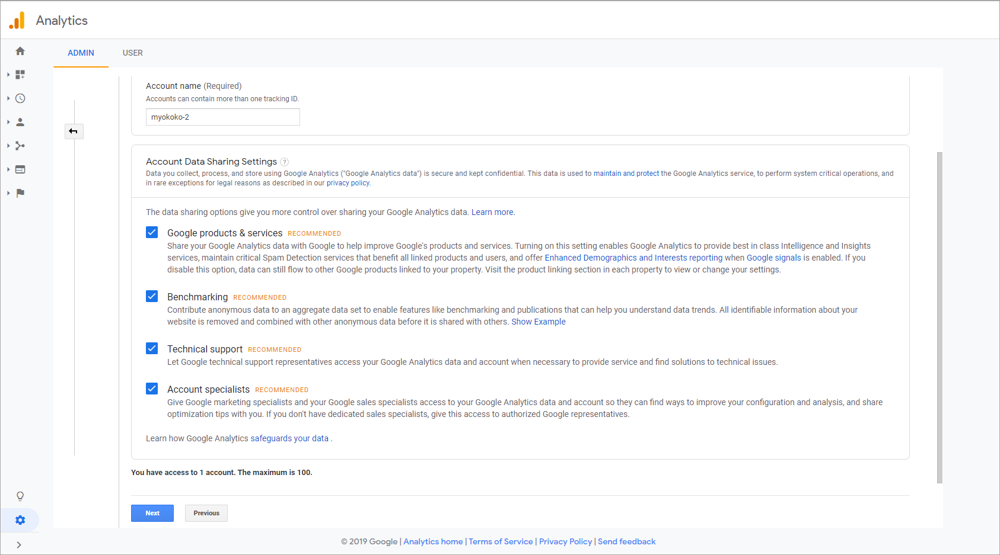<br>
5. Web ကိုပဲထားပြီး Next နှိပ်ပါ။
 	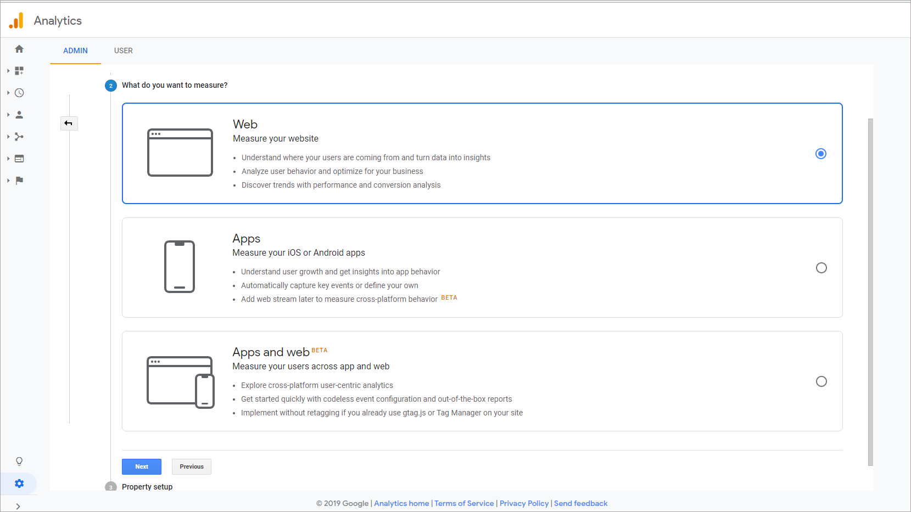
6. Property Setup ရောက်ပါပြီ။
	- Website Name: ကိုကြိုက်တာပေးပါ။
	- Website URL: den-saku url ထည့်ပါ။ local ဆို 127.0.0.1 ဆိုပြီးပဲထည့်ပါ။
	- Industry Category: Shopping ပဲရွေးလိုက်ပါ။
	- Reporting Time Zone: real site အတွက် Japan ရွေးပါ။ local ဆို Myanmar time ပဲရွေးလိုက်ပါ။
	- Create နှိပ်ပါ။
	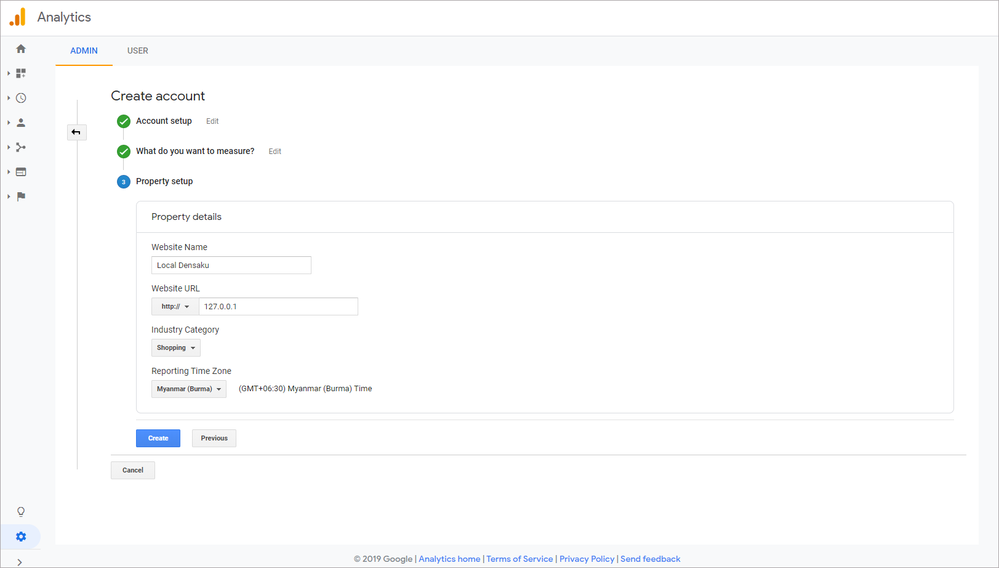
7. Term of Service တွေ၊ User Agreement တွေကို Accpet လုပ်ပြီး အောက်ဆုံးက I Accept button ကိုနှိပ်ပါ။
8. အောက်ပုံကျလာပါမယ်။ GA account တစ်ခုနဲ့ Property တစ်ခုတည်ဆောက်လို့ပြီးပါပြီ။ **Tracking ID** ကို Copy ကူးပြီး notepad ပေါ်ခဏတင်ထားလိုက်ပါ။
	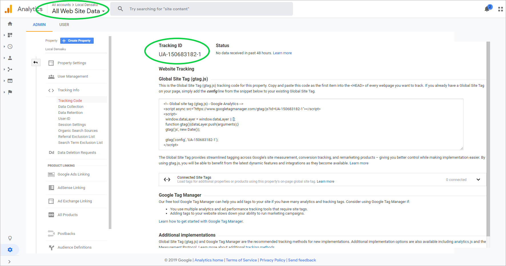
9. အပေါ်အစိမ်းရောင်အဝိုင်းကို select လုပ်ပြီး ကျွန်တော်တို့ GA အကောင့်တွေ Property တွေကို ပြောင်းကြည့်လို့ရပါတယ်။
10. Google အကောင့်တစ်ခုအတွက် GA အကောင့် ၁၀ ခုရပါတယ်။ GA အကောင့် ၁ခုမှာ Property အခု 50 ရပါတယ်။

[မာတိကာသို့ ->](#content)

## <a id="gtm-setup">GTM စတင်သုံးစွဲခြင်း

1. https://tagmanager.google.com သို့သွားပါ။
2. အကောင့်တစ်ခု အသစ်လုပ်ပါ။
3. အောက်ပါပုံနဲ့တူတဲ့ Form တစ်ခုရလာပြီဆို data ဖြည့်ပါ။
	- Account name: အဆင်ပြေတာရပါတယ်။
	- Country: production ရောက်ရင်တော့ Japan လုပ်ထားလိုက်ပါ။ local ဆိုရင် US ပဲထည့်လိုက်ပါ။
	- Container name: production ရောက်ရင် website လိပ်စာအမှန်ထည့်လိုက်ပါ။ local ဆိုတော့ အဆင်ပြေတာထည့်ပါ။
	- Target Platform: Web ကိုပဲရွေးပါ။
	- Create button ကိုနှိပ်ပါ။
	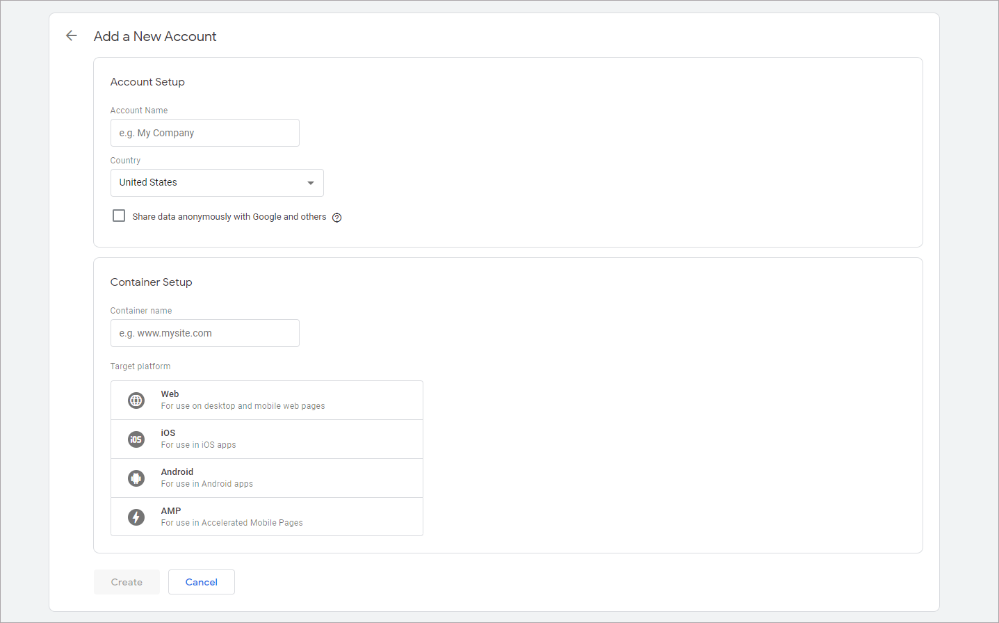
4. Workspace manage လုပ်တဲ့ page ကိုရောက်သွားပါမယ်။
	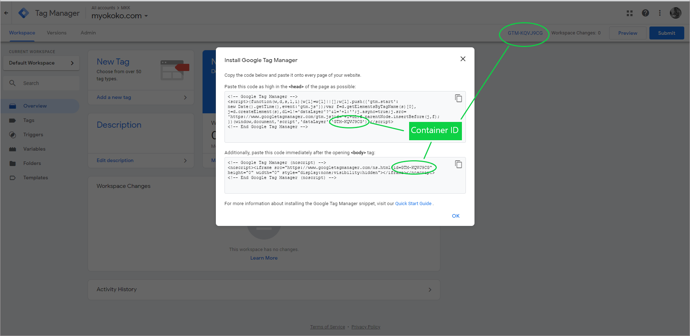
	**Container ID** တွေကို ဂရုစိုက်ပါ။ အဲ့ဒါတွေက အတူတူပဲဖြစ်ရပါမယ်။
5. အပေါ်ပိုင်းက code တွေကို  `default_frame.twig` ဖိုင်ထဲမှာ ထည့်ရပါမယ်။ *(ဒီနေရာကစပြီး EC-Cube ရဲ့ Source code တွေကိုပြင်ပါတော့မယ်)*
6. `default_frame.twig` ဟာနေရာ ၂ခုမှာရှိတတ်ပါတယ်။ `src/Eccube/Resource/template/default` နဲ့ `app/template/default` အောက်မှာတွေပါ။ `app/template/default` ကို ဦးစားပေးယူပါတယ်။ EC-Cube ရဲ့ Documentation အရ ကိုယ်ပိုင် template သုံးမယ်ဆိုရင် `app/template` အောက်မှာပဲသွားရေးပါလို့ ပြောထားပါတယ်။ `app/template` ထဲမရေးဘဲ `src/Eccube/Resource` အောက်က ဖိုင်ကိုပဲသွားပြင်မယ်ဆိုဘာဖြစ်မလဲ? အဖြေကတော့ ဘာမှမဖြစ်ပါဘူး။ မိမိစိတ်ကြိုက်နေရာမှာသွားပြင်လို့ရပါတယ်။ 
7. အဆင့် ၄ မှာပြထားတဲ့ JavaScript အပေါ်ပိုင်းကို  `<head>` tag အဖွင့်ပြီးတဲ့နေရာမှာ ထည့်ရပါမယ်။
	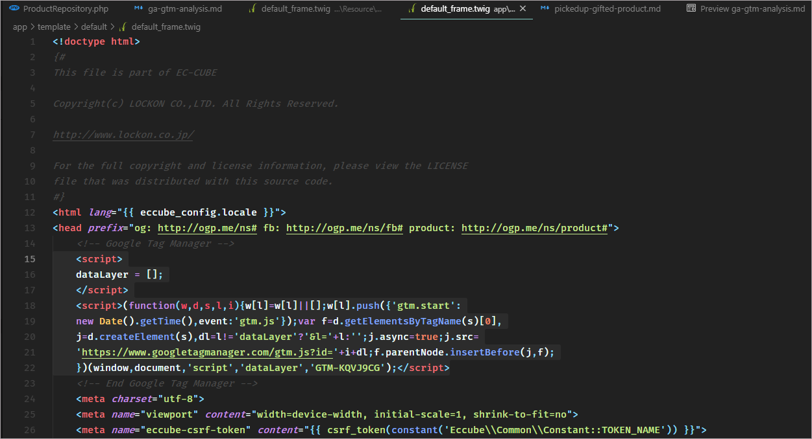	
8. JavaScript အောက်ပိုင်းကိုတော့ `<body>` tag အဖွင့်ပြီးရင်ထည့်ရပါမယ်။
	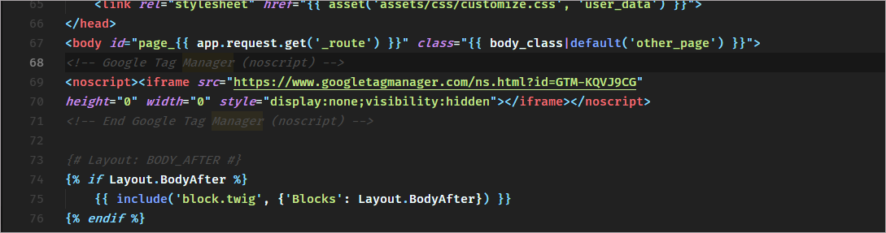
9. ဒါဆိုတော့ Setup ပြီးသွားပြီဖြစ်ပါတယ်။

[မာတိကာသို့ ->](#content)

## <a id="detail-manage">အသေးစိတ်စီမံခန့်ခွဲခြင်း

GTM မှာ အပိုင်း ၃ ပိုင်းပါပါတယ်။ Trigger, Variable နဲ့ Tag တွေပါ။ Web page element တွေရဲ့ event တွေကို trigger ကစောင့်ကြည့်ပါတယ်။ ကျွန်တော်တို့ တည်ဆောက်ထားတဲ့ trigger ရဲ့ကွင်းစက်ထဲဝင်လာပြီဆိုတာနဲ့ အဲ့ trigger တွေက ဆိုင်ရာဆိုင်ရာ Tag တွေကို Event data တွေ ပေးပို့လိုက်မှာဖြစ်ပါတယ်။ အဲ့ data တွေက variable အနေနဲ့ Tag ကတစ်ဆင့် Third party service တွေဖြစ်တဲ့ Google Analytics တို့လို server တွေကိုရောက်လာပါတယ်။ အဲ့ variable တွေမှာ သူမှတ်ထားတဲ့ default variable တွေအပြင် ကျွန်တော်တို့ကိုယ်တိုင်သတ်မှတ်ထားတဲ့ varible ကိုပါ ပို့လို့ရပါတယ်။ အဲ့ဒါနဲ့ ကျွန်တော်တို့ဟာ Product data တွေကို ပို့မှာဖြစ်ပါတယ်။

### <a id="manage-product-list"></a>Product List View Count ကို စီမံခန့်ခွဲခြင်း

1. GTM Dashboard ကနေ Triggers ကို သွားလိုက်ပါ။
	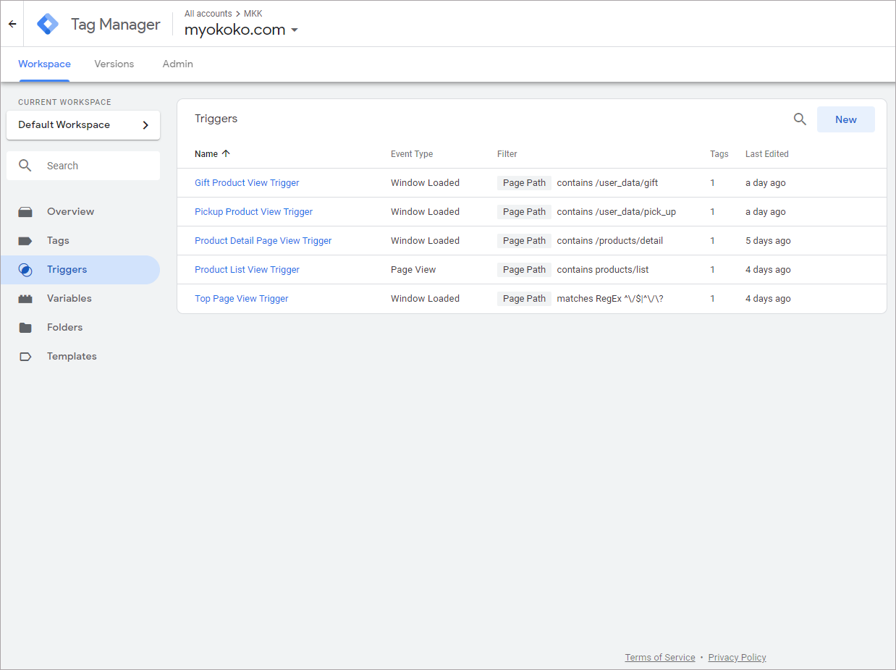
2. New button ကိုနှိပ်ပြီး Trigger အသစ်လုပ်လိုက်ပါ။
3. အောက်ပါအတိုင်း Setting ပေးလိုက်ပါ။
	- Trigger နာမည်ကို ကြိုက်တာပေးပါ။
	- Trigger Type: Page View
	- This trigger fires on: Some Page Views
	- Page Path: contains: products/list
	- Save ကိုနှိပ်ပါ။
	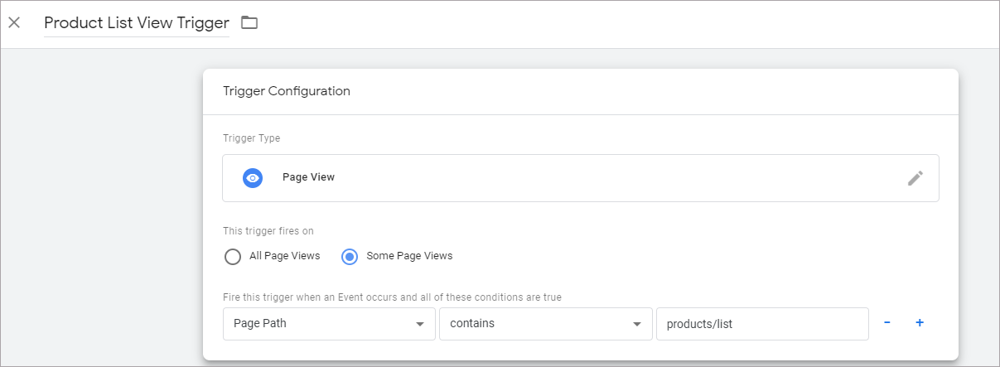
4. GTM Dashboard ကနေ Tags ကို သွားလိုက်ပါ။
5. New button ကို နှိပ်လိုက်ပါ။
6. အောက်ပါအတိုင်း Setting ပေးလိုက်ပါ။
	- Tag နာမည်ကို ကြိုက်တာပေးပါ။
	- Tag Configuration အောက်က Icon ဝိုင်းဝိုင်းကို နှိပ်ပါ။
		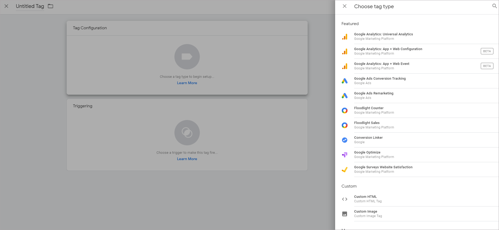
	- Google Analytics: Universal Analytics ကိုရွေးပါ။
	- Track Type: Event ကိုရွေးလိုက်ပါ။
	- Category: **ဒီမှာ ကျွန်တော်ကတော့ page action ကိုရေးလိုက်ပါတယ်။ ဒီစာသားအတိုင်း GA မှာသွားပေါ်တာဖြစ်လို့ ဒီမှာ အသေအချာရေးရပါမယ်။ Production site ရောက်ရင်တော့ Japan လို description ရေးမှာဖြစ်ပါတယ်။ လောလောဆယ်တော့ English လိုပဲ ရေးထားလိုက်ပါတယ်။**
		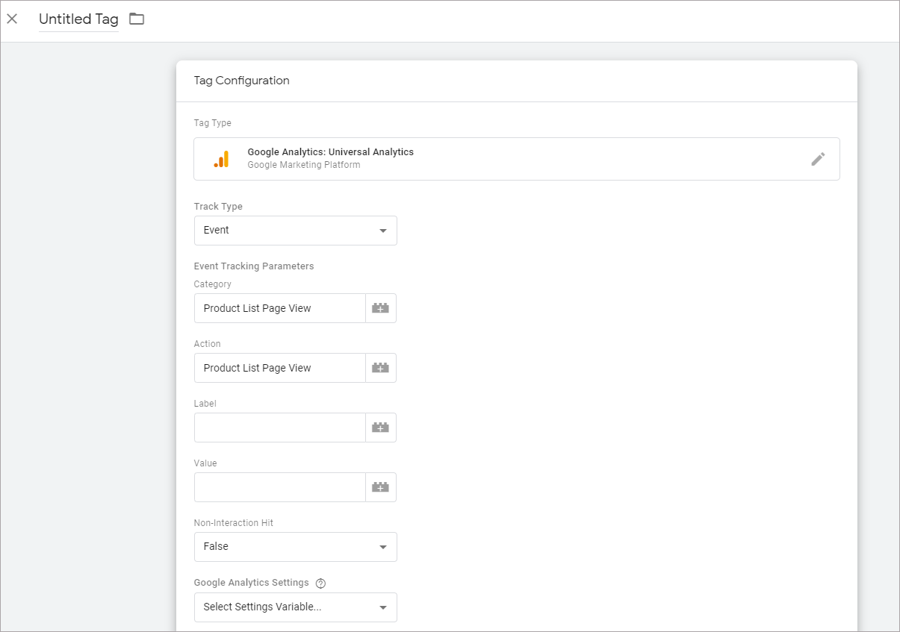
	- Action: အဆင့် ၅ အတိုင်းပါပဲ။ လောလောဆယ်တော့ Product List view ဆိုပြီးပဲ ရေးထားပါတယ်။
	- Label, value, non-interaction hit တွေကို ဒီတိုင်းပဲထားပါမယ်။
	- Google Analytics Settings: မှာ New variable ဆိုတာကို ရွေးလိုက်ပါ။ Dialog ထပ်ထွက်လာပါမယ်။
		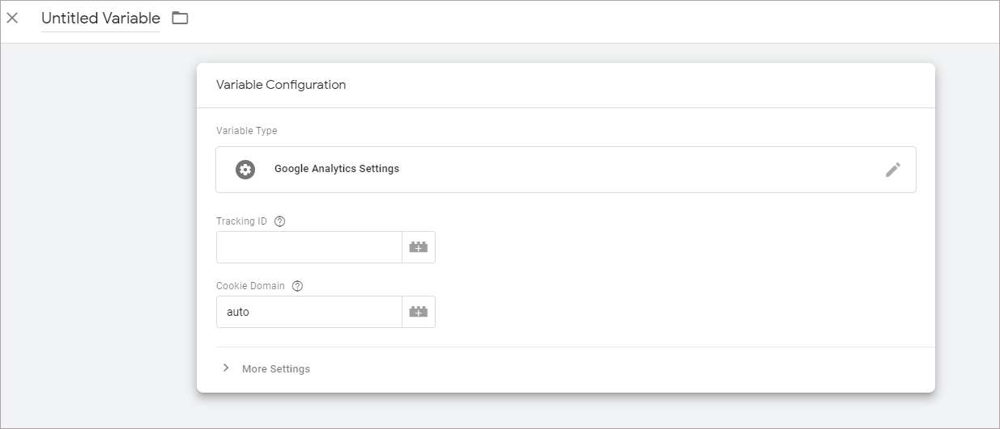
	- Variable name ကိုအဆင်ပြေတာပေးပါ။ ပြီးရင် Google Analytics ကို စတင်သုံးစွဲတုန်းက **Tracking ID** ကိုထည့်ပေးရမှာဖြစ်ပါတယ်။
	- ပြီးရင် Save ကိုနှိပ်ပါ။
	- Triggering အောက်က Icon ဝိုင်းဝိုင်းကို နှိပ်ပါ။ 
	- ပြီးရင် အဆင့် ၃ တုန်းက လုပ်ခဲ့တဲ့ Trigger ကိုရွေးလိုက်ပါ။
	- ပြီးရင် Save ကိုနှိပ်ပါ။
7. Dashboard ရဲ့ ညာဘက်အပေါ်မှာ Submit button ကို နှိပ်လိုက်ပါ။
8. ဘာမှမရေးဘဲ ညာဘက်အပေါ်မှာ Publish button ကိုနှိပ်ပါ။
9. Continue ကို ထပ်နှိပ်ပါ။
10. Version နံပါတ်အသစ်နဲ့ commit တစ်ခုပြီးသွားပါပြီ။
11. Workspace tab ကိုပြန်သွားပါ။
12. Dashboard ရဲ့ ညာဘက်အပေါ်မှာ Preview button ကို နှိပ်လိုက်ပါ။ Tag manager ရဲ့ Debug mode ရောက်နေပါပြီ။
	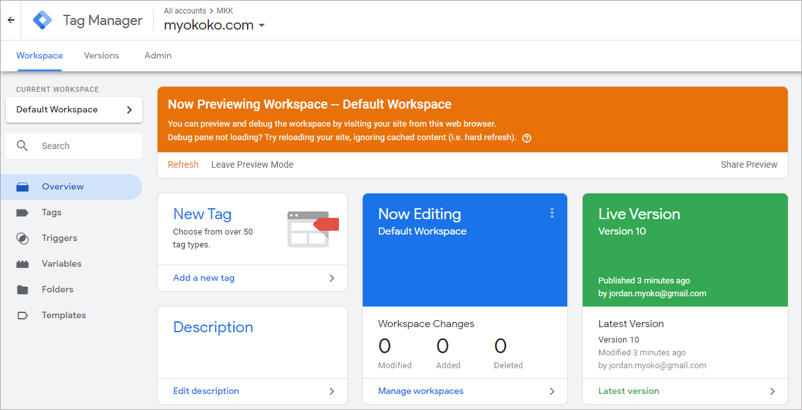
13. Browser Tab အသစ်ဖွင့်ပြီး `localhost/densaku/products/list` ဆိုပြီးရိုက်ထည့်ကြည့်ပါ။
14. အောက်ကလို Tag Manager ဆိုပြီး debug panel ကျလာပါတယ်။ အဲ့မှာ Page ရဲ့ ဘယ်အချိန်မှာ ဘယ် Tag တွေ Fire ဖြစ်သွားသလဲဆိုတာတွေ့ရမှာပါ။
	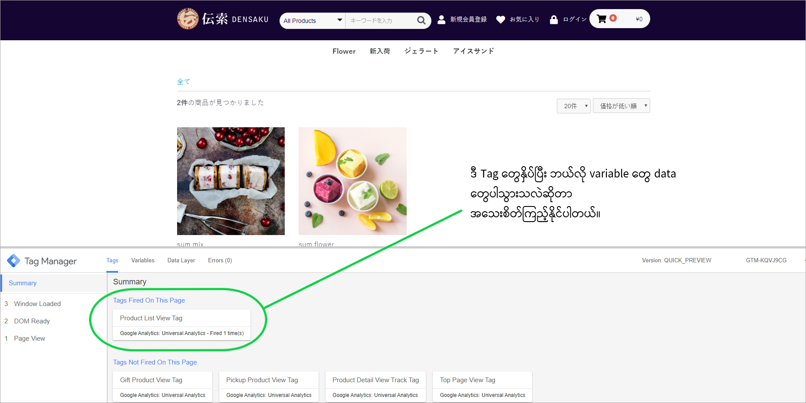
15. https://analytics.google.com သို့သွားပါ။
16. ဘယ်ဘက်က navigation menu ကနေ Realtime > Events သို့သွားပါ။
17. Event Category column အောက်မှာ ကျွန်တော်တို့ Tag ဆက်တင်ချိန်တုန်းက ပေးခဲ့တဲ့ Property တွေပါလာတာ တွေ့ပါလိမ့်မယ်။
	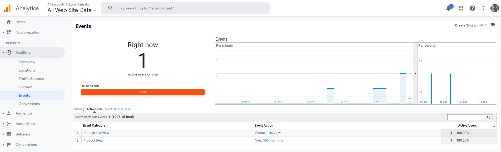
18. Tag ကအလုပ်လုပ်သွားပြီးဆိုရင် အဆင့် ၁၂ နေရာပြန်သွားပြီး Preview Mode ကိုပိတ်လိုက်လို့ရပါပြီ။

[မာတိကာသို့ ->](#content)

### <a id="product-detail-manage"></a>Product Detail View Count ကိုစီမံခန့်ခွဲခြင်း

1. Google Tag Manager ရဲ့ Variables menu သို့သွားပါ။
2. User-Defined Variables အပိုင်းထဲက New Button ကိုနှိပ်ပါ။
3. ပေါ်လာတဲ့ Dialog မှာ Variable name တစ်ခုပေးပါ။ လောလောဆယ်ကတော့ product name အတွက်လုပ်မှာဖြစ်တဲ့အတွက် **dlv - productName** ဆိုပြီးပဲ ထားလိုက်ကြရင်ကောင်းပါတယ်။ Variable Configuration အောက်က Icon ဝိုင်းဝိုင်းကို နှိပ်ပါ။
	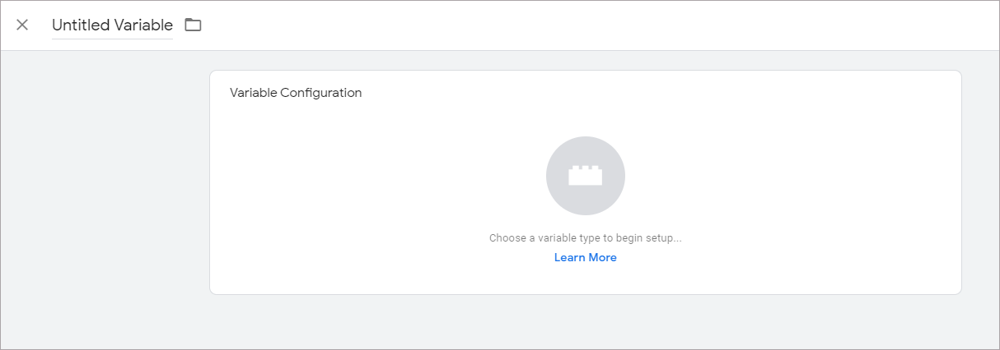
4. Data Layer Variable ဆိုတာကိုရွေးပါ။
	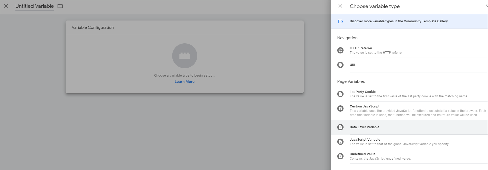
5. Data Layer Vaiable Name မှာ **product.productName** ဆိုပြီးပေးပါ။ ဒီမှာ ကိုကြိုက်တာပေးလို့ရပေမဲ့ ဒီ Variable က Product Name အတွက်လုပ်တာဖြစ်တဲ့အတွက် အထက်ပါအတိုင်းပဲထားလိုက်ပါ။
6. ပြီးသွားရင် Variable က ဒီလိုပုံအတိုင်းဖြစ်နေရပါမယ်။
	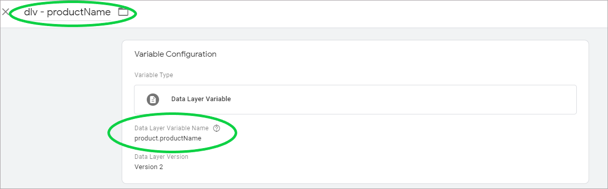
7. အဆင့် ၂ ကနေ ၆ လိုမျိုးပဲ User-Defined Variable အသစ်ထပ်လုပ်ပါ။ ဒီတစ်ခါတော့ product code အတွက်ဖြစ်ပါတယ်။ Name ကို **dlv - productCode** လို့ပေးပြီး Data Layer Variable Name ကိုတော့ **product.productCode** လို့ပေးထားပါ။
	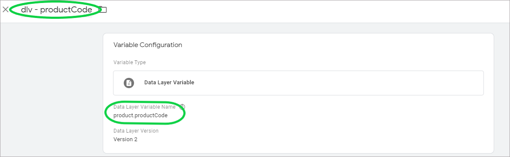
8. Trigger တစ်ခုအသစ်ထပ်လုပ်ပါမယ်။ အပေါ်မှာပါပြီးသားဖြစ်တဲ့အတွက် ထပ်အသေးစိတ်မပြောတော့ပါဘူး။ ထည့်ရမယ် Settings တွေပဲ ပြောပါမယ်။
	- Trigger Name: ကြိုက်တာပေးပါ။ ဒီမှာတော့ product detail view count ဖြစ်တဲ့အတွက် Product Detail Page View Trigger လို့ပဲ ပေးထားပါတယ်။
	- Trigger Type: Window Loaded
	- This trigger fires on: Some Window Loaded Events
	- Page Path: contains: /products/detail
	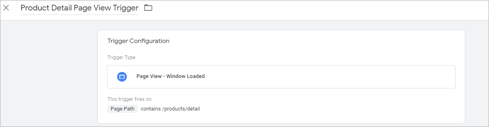
9. Tag တစ်ခုအသစ်ထပ်လုပ်ပါမယ်။ အပေါ်မှာပါပြီးသားဖြစ်တဲ့အတွက် ထပ်အသေးစိတ်မပြောတော့ပါဘူး။ ထည့်ရမယ် Settings တွေပဲ ပြောပါမယ်။
	- Tag Name: ကြိုက်တာပေးပါ။ ဒီမှာတော့ product detail view count ဖြစ်တဲ့အတွက် Product Detail Page View Tag လို့ပဲ ပေးထားပါတယ်။
	- Tag Type: Google Analytics: Universal Analytics ကိုရွေးပါ။
	- Track Type: Event 
	- Category: **ဒီမှာ ကျွန်တော်ကတော့ Product Detail လို့ရေးလိုက်ပါတယ်။ ဒီစာသားအတိုင်း GA မှာသွားပေါ်တာဖြစ်လို့ ဒီမှာ အသေအချာရေးရပါမယ်။ Production site ရောက်ရင်တော့ Japan လို description ရေးမှာဖြစ်ပါတယ်။ လောလောဆယ်တော့ English လိုပဲ ရေးထားလိုက်ပါတယ်။**
	- Action: **View {{dlv - productCode}} - {{dlv - productName}}** တွန့်ကွင်း ၂ ထပ်ထဲက Variable name ကိုမှတ်မိကြမှာပါ။ အဲ့ဒါတွေက အဆင့် ၁ ကနေ ၇ အထိလုပ်ခဲ့တဲ့ variable တွေပါပဲ။ ဒီ tag ကတစ်ဆင့် ကျွန်တော်တို့ဟာ GA မှာ product information တွေကို ရမှာဖြစ်ပါတယ်။ Production site ရောက်ရင်တော့ Japan လို description ရေးမှာဖြစ်ပါတယ်။ လောလောဆယ်တော့ English လိုပဲ ရေးထားလိုက်ပါတယ်။
	- Google Analytics Settings: ဒီမှာဆိုရင် drop down ကိုနှိပ်ပြီး ရှိပြီးသား Google Analytics Varaible ကို ရွေးပေးလိုက်ရုံပါပဲ။ *(အပေါ်အပိုင်းတုန်းက ကျွန်တော်တို့က create လုပ်ပြီးသားဖြစ်လို့ပါ။)*
	- Firing Triggers: ဒီမှာတော့ အဆင့် ၈ တုန်းက လုပ်ခဲ့တဲ့ Trigger ကို ချိတ်ပေးရပါမယ်။
10. Tag သည်အောက်ကပုံလို setting ချိန်ထားရပါမယ်။
	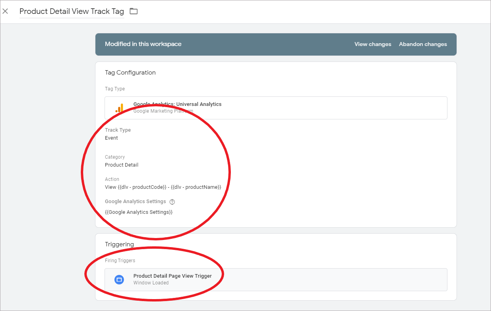
11. ကျွန်တော်တို့ရဲ့ variable တွေကို JavaScript နဲ့ data ထည့်ပါ‌ောာ့မယ်။ အဲ့အတွက် Den-saku ရဲ့ အက်မင်ပန်နယ်ကိုသွားပါ။ Contents > Pages > 商品詳細ページ ကို ရှာပြီး Edit လုပ်ပါ။ 
12. `` နောက်ကဆက်ပြီး အောက်က script လေးထည့်ပါမယ်။ *(Line no.95 လောက်ကျပါမယ်)*
	```
	<script>
		$(document).ready(function() {
		dataLayer.push({
			'product': {
				'productId': {{ Product.id }},
				'productCode': '{{ Product.code_min }}',
				'productName': '{{ Product.name }}'
			}
		});
		});        
	</script>
	```
13. အောက်ပါအတိုင်း ဖြစ်ပါတယ်။
	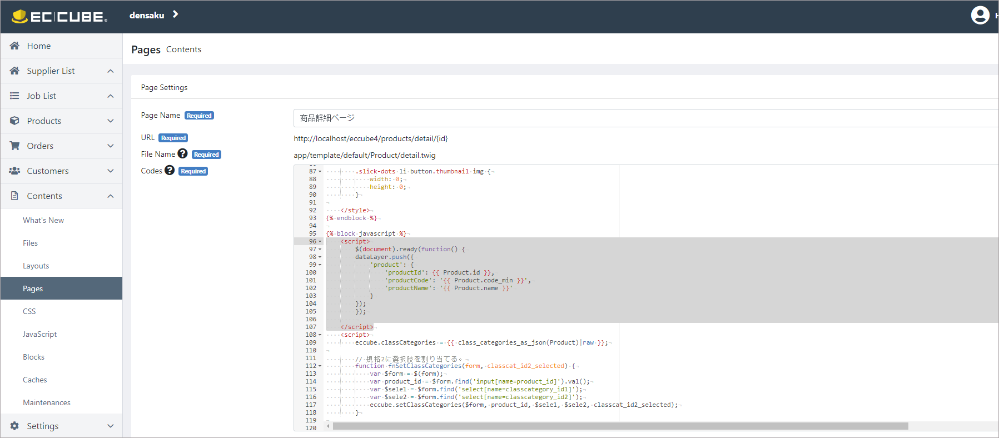
14. ပြီးရင် Google Tag Manager မှာ Submit > Publish > Preview လုပ်ထားလိုက်ပါ။
15. Densaku app မှာ product တစ်ခုကို detail သွားကြည့်လိုက်ပါ။
16. Tag fire ဖြစ်သွားကြောင်း Tag manager ရဲ့ debug panel မှာ ပေါ်နေပါမယ်။ 
	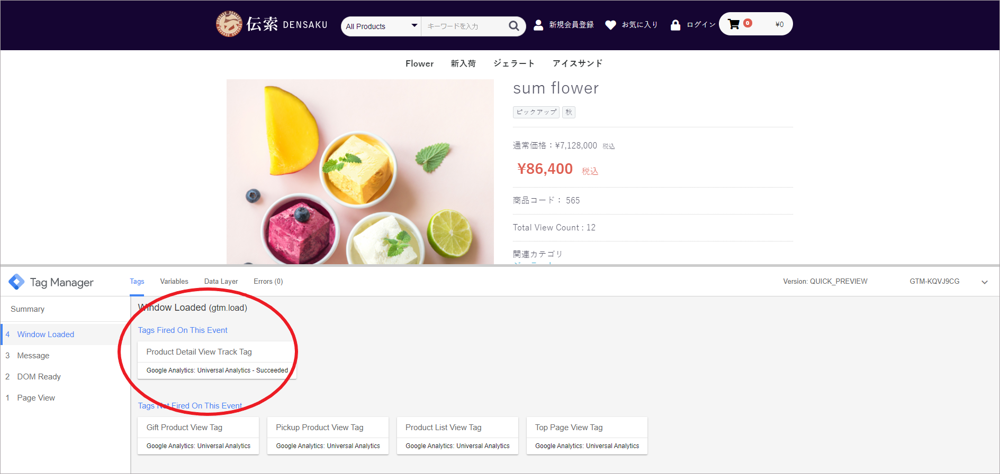
17. Debug window မှာ Variable Tab ကိုဖွင့်ပြီးတော့ ကျွန်တော်တို့ရဲ့ variable ထဲမှာ ဘာ value တွေပါသွားသလဲဆိုတာကိုပါ ကြည့်နိုင်ပါတယ်။
	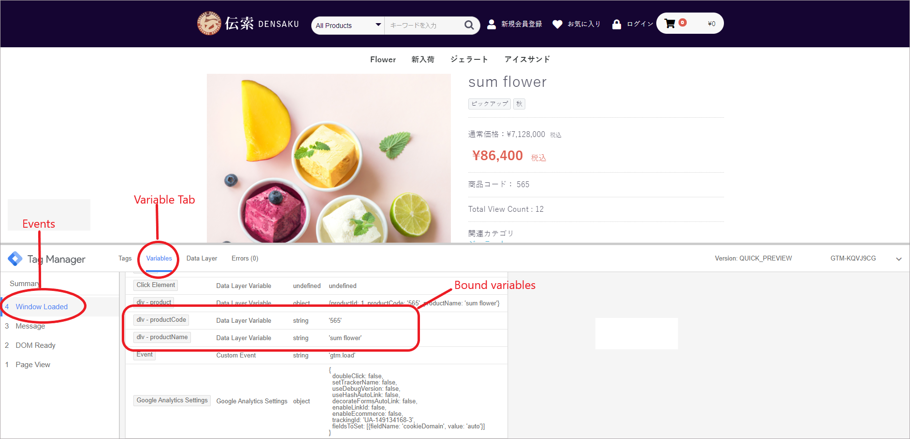
18. Google Analytics ရဲ့ Realtime -> Events မှာသွားကြည့်လိုက်ရင် အခုလိုမြင်ရပါလိမ့်မယ်။
	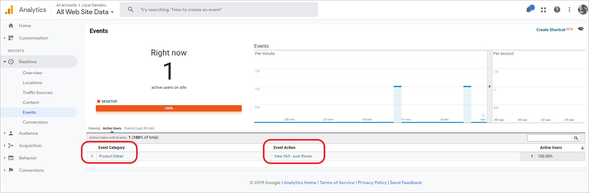
19. ဒါဆိုရင် product detail view count ကို ကြည့်လို့ရသွားပါပြီ။ အလုပ်လုပ်ပုံကတော့ GTM မှာ user-defined variable များဟာ ကျွန်တော်တို့ရဲ့ app ထဲမှာ `dataLayer` ဆိုတဲ့ array ရဲ့ element တွေပဲဖြစ်ပါတယ်။ ဒီ array ကပဲ GTM ကတစ်ဆင့် GA ကိုရောက်ရှိလာတာဖြစ်ပါတယ်။

[မာတိကာသို့ ->](#content)


