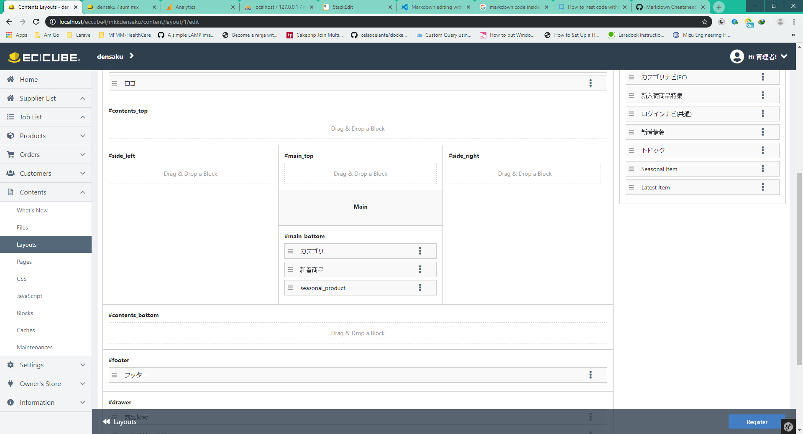

# Pick-up Prodcuts နှင့် Gift Products Page များတည်ဆောက်ခြင်း
## Pick-up Products
1. Admin Panel ကနေ အောက်ပါ Tag ၂ ခုအသစ်ဆောက်ပါ။ Pick-up **(ピックアップ)** နဲ့ Gift **(お中元　お歳暮)**.
 လက်သည်းကွင်းထဲက ဂျပန်စာလုံးတွေကိုပဲ အသုံးပြုပါ။
2. Product တွေကို ဆိုင်ရာ Tag တွေနဲ့ချိတ်ပါ။ *(optional)*
3. **Contents** > **Pages** သို့သွားပါ။
4. Page တစ်ခု အသစ်ဆောက်ပါ။
    - Page Name: Picked Up (ピックアップ) Page
    - URL: pick_up
    - File Name: pick_up
5. အောက်ပါကုဒ်များထည့်ပါ။
	```Twig
	
	

	

	
	<div class="ec-role">
		<div class="ec-newItemRole">
			<div class="ec-newItemRole__list">
				<div class="ec-newItemRole__listItem">
					<div class="ec-newItemRole__listItemHeading ec-secHeading--tandem">
						<span class="ec-secHeading__en">ピックアップ</span>
						<span class="ec-secHeading__line"></span>
						<span class="ec-secHeading__ja"></span>
						<a class="ec-inlineBtn--top" href="{{ url('product_list') }}">{{ 'more'|trans }}</a>
					</div>
				</div>
				
				<div class="ec-newItemRole__listItem">
					<a href="{{ url('product_detail', {'id': product.id}) }}">
						
						<p class="ec-newItemRole__listItemTitle">{{ product.name }}</p>
						<p class="ec-newItemRole__listItemPrice">{{ product.price02_min|price }}(税込)</p>
					</a>
				</div>
				
			</div>
		</div>
	</div>

	
	```
6. Layout Setting -> PC မှာတော့ **下層ページ用レイアウト** ဆိုတာကိုရွေးရပါမယ်။
7. တခြားဟာတွေကိုတော့ ဒီတိုင်းပဲထားပါ။
8. Save လိုက်ပါ။

## Gift Products
1. **Contents** > **Pages** သို့သွားပါ။
2. Page တစ်ခု အသစ်ဆောက်ပါ။
    - Page Name: Gift (お中元　お歳暮) Page
	- URL: gift
	- File Name: gift
3. အောက်ပါကုဒ်များထည့်ပါ။
	```Twig
	
	
	

	

	
	<div class="ec-role">
		<div class="ec-newItemRole">
			<div class="ec-newItemRole__list">
				<div class="ec-newItemRole__listItem">
					<div class="ec-newItemRole__listItemHeading ec-secHeading--tandem">
						<span class="ec-secHeading__en">ピックアップ</span>
						<span class="ec-secHeading__line"></span>
						<span class="ec-secHeading__ja"></span>
						<a class="ec-inlineBtn--top" href="{{ url('product_list') }}">{{ 'more'|trans }}</a>
					</div>
				</div>
				
				<div class="ec-newItemRole__listItem">
					<a href="{{ url('product_detail', {'id': product.id}) }}">
						
						<p class="ec-newItemRole__listItemTitle">{{ product.name }}</p>
						<p class="ec-newItemRole__listItemPrice">{{ product.price02_min|price }}(税込)</p>
					</a>
				</div>
				
			</div>
		</div>
	</div>

	
	```
4. Layout Setting -> PC မှာတော့ **下層ページ用レイアウト** ဆိုတာကိုရွေးရပါမယ်။
5. တခြားဟာတွေကိုတော့ ဒီတိုင်းပဲထားပါ။
6. Save လိုက်ပါ။

## Page အသစ် ၂ ခုအတွက် URL ထည့်ခြင်း
1. **Contents** > **Blocks** သို့သွားပါ။
2. **カテゴリ** ဆိုတဲ့ Block ကိုရှာပါ။ Edit လုပ်ပါ။
3. Line no.39 နဲ့ 44 လောက်မှာ `<a>` element ရှိပါလိမ့်မယ်။ *(39 ကတော့ Pickup Product အတွက်ဖြစ်ပြီး 44 ကတော့ Gift Product အတွက်ဖြစ်ပါတယ်။)*
4. `href` attribute ကိုတော့ အောက်ပါအတိုင်းပြင်ပါ။
    - Pick-up products link : `href="{{ url('user_data',{'route':'pick_up'}) }}"`
    - Gift products link : `href="{{ url('user_data',{'route':'gift'}) }}"`
5. ကုဒ်အပြည့်အစုံ:
	```Twig
	{#
	This file is part of EC-CUBE

	Copyright(c) LOCKON CO.,LTD. All Rights Reserved.

	http://www.lockon.co.jp/

	For the full copyright and license information, please view the LICENSE
	file that was distributed with this source code.
	#}
	<style>
		.ec-categoryRole {
			background: #fff;
		}
		@media only screen and (max-width: 767px){
			.ec-categoryRole .ec-categoryRole__listItem{
				width: 50%;
			}
			.ec-categoryRole .ec-categoryRole__listItem a{
				display: inline-block;
				width: 95%;
			}
			.ec-categoryRole .ec-categoryRole__listItem:nth-child(even){
				text-align: right;
			}
		}
		
	</style>

	<div class="ec-categoryRole">
		<div class="ec-role">
			<div class="ec-secHeading">
				{#<span class="ec-secHeading__en">{{ 'CATEGORY'|trans }}</span>#}
				{#<span class="ec-secHeading__line"></span>#}
				<span class="ec-secHeading__en">{{ 'カテゴリ'|trans }}</span>
			</div>
			<div class="ec-categoryRole__list">
				<div class="ec-categoryRole__listItem">
					<a href="{{ url('user_data',{'route':'pick_up'}) }}">
						
					</a>
				</div>
				<div class="ec-categoryRole__listItem">
					<a href="{{ url('user_data',{'route':'gift'}) }}">
						
					</a>
				</div>
				<div class="ec-categoryRole__listItem">
					<a href="http://renew.den-saku.com/supplierdensaku/public/jobSearch">
						
					</a>
				</div>
				<div class="ec-categoryRole__listItem">
					<a href="#" target="_blank">
						
					</a>
				</div>
			</div>
		</div>
	</div>
	```
6. ပြီးသွားပြီဆို Save လိုက်ပါ။
7. Top Page layout setting မှာ **カテゴリ** Block ရှိနေကြောင်း စစ်ဆေးပါ။<br>
	