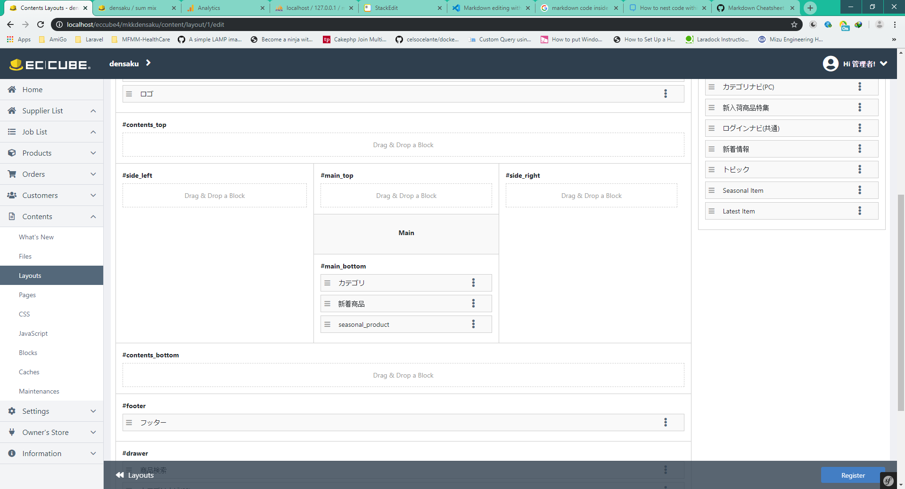

## Seasonal items ထည့်ခြင်း
1. Admin panel ကနေ **Products** > **Tags** သို့သွားပြီး Tag ၄ ခုအသစ်ဆောက်ပါ။<br>
    Season တွေအတွက် ဂျပန်စာလုံးတွေကိုပဲ သုံးပါ။ (春 夏 秋 冬)
2. Products တွေကို အဲ့ဒီ Tag တွေနဲ့ချိတ်ပါ။ Product တစ်ခုကို Tag အများကြီးနဲ့ ချိတ်လို့ရပါတယ်။
3. **Contents** > **Blocks** သို့သွားပြီး အောက်ပါကုဒ်များဖြင့် Block တစ်ခုအသစ်လုပ်ပါ။
	```Twig
	
	
	
	
	
	
	
	
	
	
	
	

	
	

	
	
	
	
	
	
	
	{#
	This file is part of EC-CUBE

	Copyright(c) LOCKON CO.,LTD. All Rights Reserved.

	http://www.lockon.co.jp/

	For the full copyright and license information, please view the LICENSE
	file that was distributed with this source code.
	#}

	
		<style>
			.seasonal .main_slick{
				width: 100%;
				margin: 60px auto 0 auto;
				max-width: 1130px;
				padding: 0 30px;
			}
			#seasonal_slick{
				width: 94%;
				margin: 0 auto;
			}
			.slick-prev,
			.slick-next{
				font-size: 0;
				line-height: 0;
				position: absolute;
				top: 32%;
				display: block;
				width: 25px;
				height: 25px;
				padding: 0;
				-webkit-transform: translate(0, -50%);
				-ms-transform: translate(0, -50%);
				transform: translate(0, -50%);
				cursor: pointer;
				color: transparent;
				background: transparent;
				border: 1px solid transparent;
				outline: 1px solid transparent;
				background: 1px solid green;
				background: #6f6f6f;
				border-radius: 50%;
			}
			.slick-prev{
				left: -25px;
			}
			.slick-next{
				right: -25px;
			}
			.slick-prev::before {
				content: "";
				display: block;
				border-bottom: 3px solid;
				border-bottom-color: currentcolor;
				border-left: 3px solid;
				border-left-color: currentcolor;
				transform: rotate(45deg);
				width: 10px;
				height: 10px;
				border-color: #fff;
				position: absolute top: 50%;
				margin: 8px;
			}
			.slick-next::after {
				content: "";
				display: block;
				border-bottom: 3px solid;
				border-bottom-color: currentcolor;
				border-left: 3px solid;
				border-left-color: currentcolor;
				transform: rotate(-135deg);
				width: 10px;
				height: 10px;
				border-color: #fff;
				position: absolute top: 50%;
				margin: 6px;
			}
			.slick-slider {
				margin-bottom: 30px;
			}

			.slick-dots {
				position: absolute;
				bottom: -45px;
				display: block;
				width: 100%;
				padding: 0;
				list-style: none;
				text-align: center;
			}

			.slick-dots li {
				position: relative;
				display: inline-block;
				width: 20px;
				height: 20px;
				margin: 0 5px;
				padding: 0;
				cursor: pointer;
			}

			.slick-dots li button {
				font-size: 0;
				line-height: 0;
				display: block;
				width: 20px;
				height: 20px;
				padding: 5px;
				cursor: pointer;
				color: transparent;
				border: 0;
				outline: none;
				background: transparent;
			}

			.slick-dots li button:hover,
			.slick-dots li button:focus {
				outline: none;
			}

			.slick-dots li button:hover:before,
			.slick-dots li button:focus:before {
				opacity: 1;
			}

			.slick-dots li button:before {
				content: " ";
				line-height: 20px;
				position: absolute;
				top: 0;
				left: 0;
				width: 12px;
				height: 12px;
				text-align: center;
				opacity: .25;
				background-color: black;
				border-radius: 50%;

			}

			.slick-dots li.slick-active button:before {
				opacity: .75;
				background-color: black;
			}

			.slick-dots li button.thumbnail img {
				width: 0;
				height: 0;
			}
			.ec-newItemRole .ec-newItemRole__listItem:nth-child(even),
			.ec-newItemRole .ec-newItemRole__listItem:nth-child(odd){
				margin: 0 10px;
			}
			.online_subtitle {
				font-size: 132%;
				padding-bottom: 5px;
				border-bottom: 1px solid #150532;
				margin-bottom: 30px;
			}
			.online_subtitle .all {
				display: inline-block;
				font-size: 76%;
				float: right;
				color: #000;
			}
			.ec-newItemRole .ec-newItemRole__listItemPrice{
				color: red;
			}
			@media only screen and (max-width: 767px){
				.slick-prev{
					left: -25px;
				}
				.slick-next{
					right: -25px;
				}
			}
			
		</style>
	

	
		<script>
			$(function() {
				$('#seasonal_slick').slick({
				slidesToShow: {{ count }},
				slidesToScroll: 1,
				autoplay: true,
				autoplaySpeed: 2000,
				arrows: true,
					infinite: true,
				responsive: [
					{
					breakpoint: 980,
					settings: {
						slidesToShow: 3,
				slidesToScroll: 1,
				autoplay: false,
				autoplaySpeed: 2000,
					}
					},
					{
					breakpoint: 769,
					settings: {
					slidesToShow: 2,
				slidesToScroll: 1,
				autoplay: false,
				autoplaySpeed: 2000
					}
					}
				]
				});
			});
		</script>
	
	<div class="ec-role ec-sliderRole seasonal">
		<div class="ec-newItemRole main_slick">
			<h2 class="online_subtitle">季節商品<a class="all" href="/products/list">すべて見る</a></h2>
			<div class="ec-newItemRole__list" id="seasonal_slick">

				
				<div class="ec-newItemRole__listItem item slick-slide">
					<a href="{{ url('product_detail', {'id': product.id}) }}">
						
						<p class="ec-newItemRole__listItemTitle">{{ product.name }}</p>
						<p class="ec-newItemRole__listItemPrice">{{ product.price02_min|price }}(税込)</p>
					</a>
				</div>
				
			</div>
		</div>
	</div>
	```
4. **Contents** > **Layouts** > **トップページ用レイアウト** သို့သွားပါ။
5. အသစ်လုပ်ထားတဲ့ Block ကို Main area ထဲဆွဲထည့်လိုက်ပါ။<br>
		


